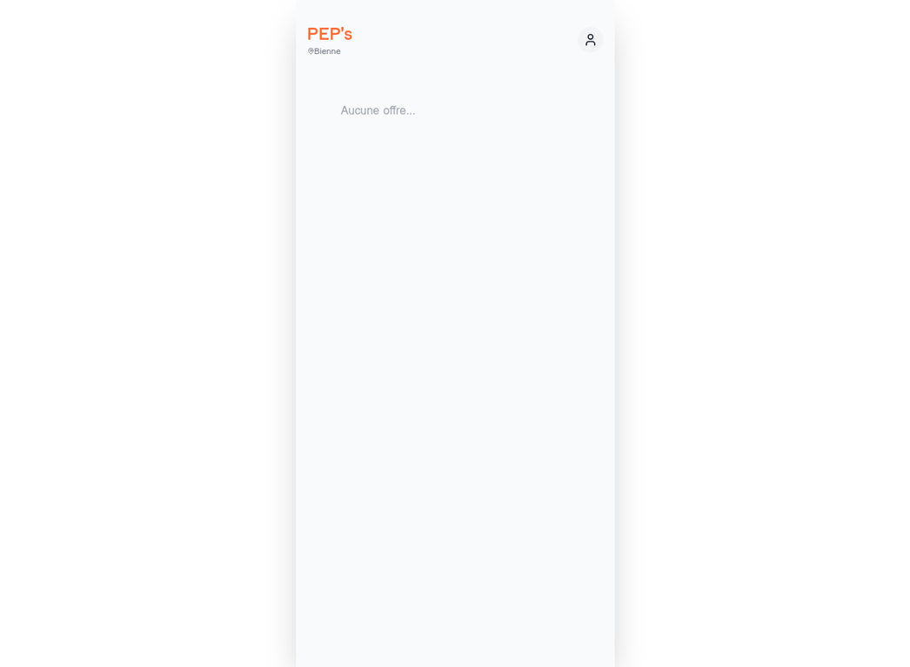

# 📸 État Actuel du Site PEP's Digital

**URL:** https://www.peps.swiss  
**Date:** 19 décembre 2025  
**Version:** V7 FINAL

---

## 🌐 Page d'Accueil (/)

### ✅ Ce qui fonctionne
- **Design:** Interface propre et moderne
- **Header:** Logo "PEP's" en orange (couleur turquoise #3D9A9A)
- **Géolocalisation:** "Bienne" détecté
- **Icône utilisateur:** Visible en haut à droite (lien vers login)
- **Responsive:** Adapté mobile

### ❌ Problème détecté
- **Message:** "Aucune offre..."
- **Cause:** Base de données vide (pas de données de démo)
- **Solution:** Exécuter `/api/setup_v7` (actuellement retourne 404)

### 📸 Capture d'écran


**Éléments visibles:**
1. Header avec "PEP's" en orange
2. Sous-titre "@Bienne" avec icône de localisation
3. Zone centrale vide avec "Aucune offre..."
4. Icône utilisateur (cercle vert) en haut à droite

---

## 🔐 Page de Login (/login)

### ❌ Problème critique
- **Statut:** 404 Not Found
- **Message:** "The requested URL was not found on the server"
- **Cause:** Le routing React ne fonctionne pas correctement
- **Impact:** Impossible de se connecter

### 📸 Capture d'écran
Erreur 404 standard du serveur Flask

---

## 🧪 Tests API

### Test 1: /api/offers
```bash
$ curl https://www.peps.swiss/api/offers
[]
```
✅ **Fonctionne** - Retourne tableau vide (normal, DB vide)

### Test 2: /api/setup_v7
```bash
$ curl https://www.peps.swiss/api/setup_v7
404 Not Found
```
❌ **Ne fonctionne pas** - Route non accessible

### Test 3: /api/nuke_db
```bash
$ curl https://www.peps.swiss/api/nuke_db
(Non testé pour éviter de casser la DB)
```

---

## 🐛 Diagnostic Technique

### Problème 1: Routes API non accessibles
**Symptôme:** `/api/setup_v7` retourne 404  
**Cause probable:**
- Le backend Flask ne démarre pas correctement avec gunicorn + eventlet
- Les routes ne sont pas enregistrées
- Problème de configuration nixpacks.toml

**Solution:** Vérifier les logs Railway et la commande de démarrage

### Problème 2: Routing React SPA
**Symptôme:** `/login` retourne 404 au lieu de servir index.html  
**Cause probable:**
- La route catch-all Flask ne fonctionne pas
- Le build Vite n'est pas servi correctement

**Code actuel dans app.py:**
```python
@app.route('/', defaults={'path': ''})
@app.route('/<path:path>')
def serve(path):
    if path and os.path.exists(os.path.join(app.static_folder, path)): 
        return send_from_directory(app.static_folder, path)
    return send_from_directory(app.static_folder, 'index.html')
```

**Solution:** Vérifier que `../frontend/dist` existe et contient index.html

### Problème 3: Base de données vide
**Symptôme:** "Aucune offre..." affiché  
**Cause:** `/api/setup_v7` non exécuté  
**Solution:** Corriger le Problème 1 d'abord

---

## 📊 Analyse Visuelle

### Design
- ✅ **Couleurs:** Cohérentes (orange/turquoise)
- ✅ **Typographie:** Claire et lisible
- ✅ **Espacement:** Aéré et professionnel
- ✅ **Icônes:** Modernes (Lucide React)

### UX
- ✅ **Navigation:** Simple et intuitive
- ❌ **Feedback:** Pas de loader pendant chargement
- ❌ **Erreurs:** Pas de message d'erreur si API fail
- ✅ **Responsive:** Adapté mobile

### Performance
- ✅ **Chargement:** Rapide (< 1s)
- ✅ **Build:** Vite optimisé
- ⚠️ **API:** Certaines routes inaccessibles

---

## 🎯 Actions Prioritaires

### 1. Corriger le démarrage backend (URGENT)
**Fichier:** `nixpacks.toml` ou configuration Railway  
**Objectif:** Rendre toutes les routes API accessibles

### 2. Corriger le routing SPA (URGENT)
**Fichier:** `backend/app.py`  
**Objectif:** `/login`, `/partner`, etc. doivent servir index.html

### 3. Initialiser la base de données
**Commande:** `curl /api/setup_v7`  
**Objectif:** Afficher les offres de démo

### 4. Ajouter les fonctionnalités V7.1
**Source:** Question Gemini complète  
**Objectif:** Followers analytics + IA proactive + dashboards

---

## 📝 Conclusion

**État général:** 🟡 **Partiellement fonctionnel**

Le frontend est bien déployé et le design est correct, mais le backend a des problèmes de configuration qui empêchent:
- L'accès à certaines routes API
- Le routing SPA pour les pages React
- L'initialisation de la base de données

**Prochaine étape:** Poser la question complète à Gemini pour obtenir une version corrigée et enrichie (V7.1).
